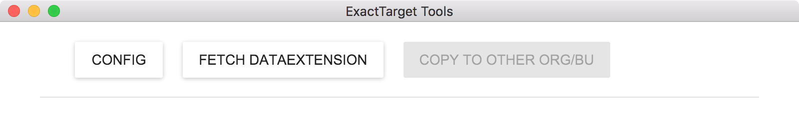
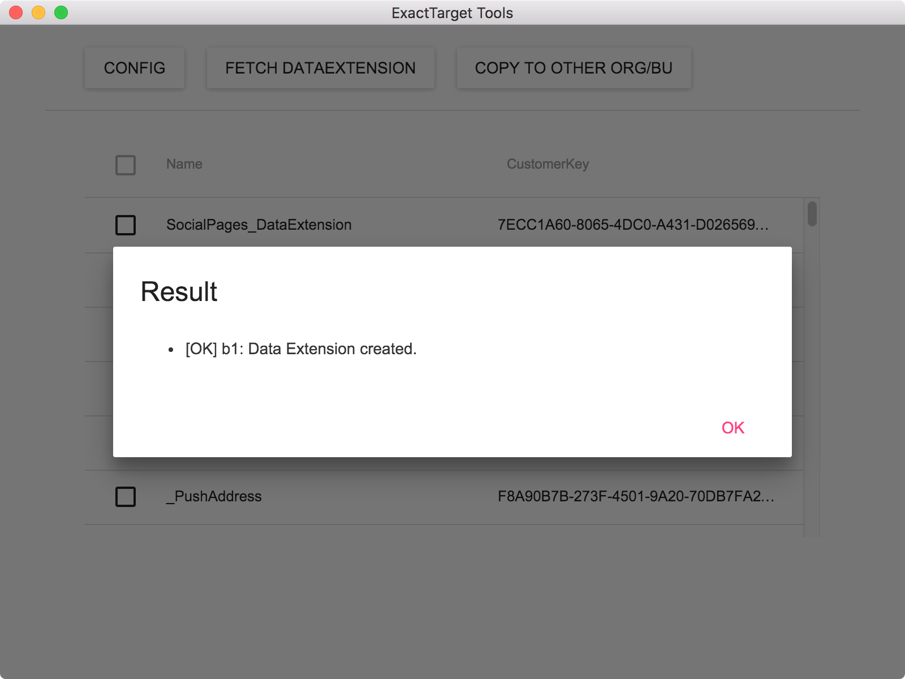

# ET_Tool
ExactTarget GUI Tool.  

## Features
* Copy to DataExtensions from one business unit to another.

## Usage

1. Launch ETApp and click "CONFIG" button.

2. Input your exacttarget application credentials for origin and click "OK" button.

3. Click "FETCH DATATEXTENSION" button.

4. Select target DataExtensions and click "COPY TO OTHER ORG/BU".

5. Input your exacttarget application credentials for destination.

5. Check target DataExtensions.

6. You can see results.

## License

The MIT License. See [LICENSE](https://github.com/tzmfreedom/ET_Tool/blob/master/LICENSE.txt) file.